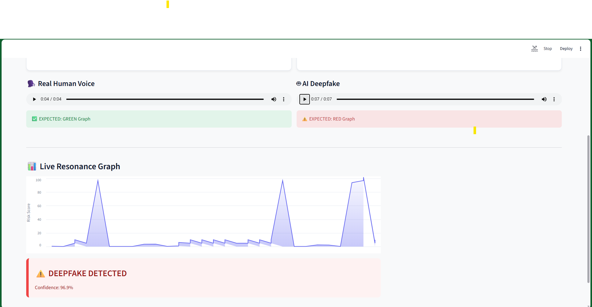

```
# AspitaTech Voice Firewall
**Real-Time Defense Against Deepfake Voice Fraud & Synthetic Audio Attacks**

---

## 1. The Problem: The "Zero-Trust" Voice Era
We have entered an era where "hearing is believing" is no longer a valid security protocol. Generative AI tools can now clone a human voice with just 3 seconds of audio. This capability is being weaponized for:
* **CEO Fraud:** Impersonating executives to authorize bank transfers.
* **Social Engineering:** Scammers mimicking family members in distress.
* **Biometric Bypass:** Fooling voice-authentication systems used by banks and support centers.

Traditional detection methods rely purely on training AI models to spot "fake" patterns. However, as deepfake generators get better, these detection models become obsolete. We needed a different approach.

## 2. The Solution: Hybrid Biometric Verification
AspitaTech Voice Firewall is not just another AI classifier. It uses a **Hybrid Detection Architecture** that combines Deep Learning with fundamental Acoustic Physics.

### The Core Engine
Our system analyzes audio in two parallel streams:

1.  **The AI Layer (Semantic Anomalies):**
    * We use a fine-tuned Transformer model (Wav2Vec2 architecture) to detect high-level artifacts in the audio waveform that are invisible to the human ear.
    * This layer is excellent at catching "cheap" deepfakes and older synthesis methods.

2.  **The Physics Layer (Biometric Liveness):**
    * *This is our key differentiator.* Real human vocal cords are imperfect. They produce micro-tremors in frequency (Jitter) and amplitude (Shimmer) due to the organic nature of muscle tissue and air pressure.
    * Generative AI models (like ElevenLabs or VALL-E) often produce mathematically "perfect" audio that lacks these organic imperfections.
    * **The Firewall Logic:** Even if the AI model is 99% sure a voice is real, our Physics Engine runs a "Jitter Analysis." If the audio is too smooth or lacks the chaotic fluctuation of biological vocal cords, the system flags it as synthetic.

---

## 3. Features

### 📡 Live Call Monitor
Designed for Zoom, Teams, and Google Meet. The system hooks into your system's loopback audio and analyzes the incoming stream in real-time.
* **Traffic Light System:** Green for Verified Human, Red for Synthetic/Deepfake.
* **Rolling Buffer:** Analyzes the last 10 seconds of context to prevent short glitches from triggering false alarms.
* **Privacy First:** All processing happens locally on your CPU/GPU. No audio is ever sent to the cloud.

### 🧪 Simulation Lab
A built-in testing environment for demonstrations and calibration.
* Includes pre-loaded samples of "Verified Human" audio and "High-Fidelity Deepfakes."
* Allows security teams to test the sensitivity of the firewall before deploying it in a live environment.

### 📂 Forensic File Audit
A dedicated tool for analyzing pre-recorded evidence.
* Drag and drop suspicious WhatsApp voice notes, MP3s, or WAV files.
* Generates a biometric report detailing the confidence score and the physical integrity of the voice.

---

## 4. Technical Architecture & Screenshots

**The Dashboard:**
A clean, "Glassmorphism" interface built with Streamlit, designed for high-stress security environments. It provides immediate visual feedback via a live biometric resonance graph.


*(Note: Upload your dashboard screenshot to a 'docs' folder and name it dashboard.png)*

**The Forensic Audit:**
Detailed analysis mode for offline files, showing the confidence breakdown.


*(Note: Upload your audit screenshot to a 'docs' folder and name it audit.png)*

---

## 5. Installation & Usage

This project is built on Python 3.10+ and requires FFMPEG for audio processing.

### Prerequisites
* Python 3.10 or higher
* Git

### Step 1: Clone the Repository
```bash
git clone [https://github.com/saaga23/VoiceFirewall.git](https://github.com/saaga23/VoiceFirewall.git)
cd VoiceFirewall

```

### Step 2: Set up the Environment

It is highly recommended to use a virtual environment to manage dependencies.

**Windows:**

```bash
python -m venv venv
.\venv\Scripts\Activate
pip install -r requirements.txt

```

**Mac/Linux:**

```bash
python3 -m venv venv
source venv/bin/activate
pip install -r requirements.txt

```

### Step 3: Run the Firewall

Launch the interface using Streamlit.

```bash
streamlit run streamlit_app.py

```

The application will open in your default web browser at `http://localhost:8501`.

---

## 6. Project Structure

* **`final_detector.py`**: The brain of the system. Contains the `VoiceFirewall` class, the loading logic for the HuggingFace model, and the `librosa` physics calculations.
* **`audio_stream.py`**: Handles the complex task of tapping into the system's loopback audio (hearing what you hear) without needing virtual cables.
* **`streamlit_app.py`**: The frontend user interface. Handles the state management, visualization (Altair charts), and user interaction.
* **`generate_offline.py`**: A utility script to generate synthetic test data locally for the Simulation Lab.

---

## 7. Future Roadmap

* **Mobile SDK:** Porting the inference engine to ONNX for use in Android/iOS secure calling apps.
* **Encrypted Logs:** Blockchain-based logging for forensic evidence chains in legal cases.
* **Enterprise API:** A Dockerized container for banking infrastructure to scan call center audio streams.

---

## 8. License & Attribution

This project is open-source under the MIT License.
**Founder/Lead Engineer:** AspitaTech
**Research Basis:** Wav2Vec2, Librosa Audio Analysis.

---

### Keywords for Discovery

Deepfake Detection, Voice Security, AI Safety, Audio Forensics, Biometric Verification, FinTech Security, Python, Streamlit, PyTorch, Real-Time Audio Analysis, Cybersecurity, SecOps, Anti-Spoofing, Synthetic Media Detection.

#DeepfakeDetection #VoiceSecurity #AI #Cybersecurity #FinTech #Python #OpenSource #AspitaTech

```

```
